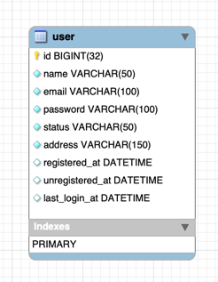

# 배달 플랫폼 백엔드 구축

---

## 프로젝트 스펙
1. Server Framework : SpringBoot 2.7.x
2. Build Tool : Gradle Groovy
3. Language : Java 11
4. Database Library : JPA
5. Database Server : MySQL 8.x

---

## API 공통 Spec
```
{
    "result" : {
        "result_code" : "200",
        "result_message" : "OK",
        "result_description" : "성공",
    },
    "body" : {
        ....
        ....
    }
}
````

## 데이터베이스



````
CREATE TABLE IF NOT EXISTS `user` (
  `id` BIGINT(32) NOT NULL AUTO_INCREMENT,
  `name` VARCHAR(50) NOT NULL,
  `email` VARCHAR(100) NOT NULL,
  `password` VARCHAR(100) NOT NULL,
  `status` VARCHAR(50) NOT NULL,
  `address` VARCHAR(150) NOT NULL,
  `registered_at` DATETIME NULL,
  `unregistered_at` DATETIME NULL,
  `last_login_at` DATETIME NULL,
  PRIMARY KEY (`id`))
ENGINE = InnoDB;
````

````
CREATE TABLE IF NOT EXISTS `delivery`.`store` (
  `id` BIGINT(32) NOT NULL,
  `name` VARCHAR(100) NOT NULL,
  `address` VARCHAR(150) NOT NULL,
  `status` VARCHAR(50) NULL,
  `category` VARCHAR(50) NULL,
  `star` DOUBLE NULL,
  `thumnail_url` VARCHAR(200) NOT NULL,
  `minimum_amount` DECIMAL(11,4) NOT NULL,
  `minimum_delivery_amount` DECIMAL(11,4) NOT NULL,
  `phone_number` VARCHAR(20) NULL,
  PRIMARY KEY (`id`))
ENGINE = InnoDB;
````

## Annotation
- @Business : 비지니스 로직
- @Converter : 객체 변환 (requset -> entity / entity -> response)

## 서비스 로직
Controller -> BusinessService -> Service -> DB